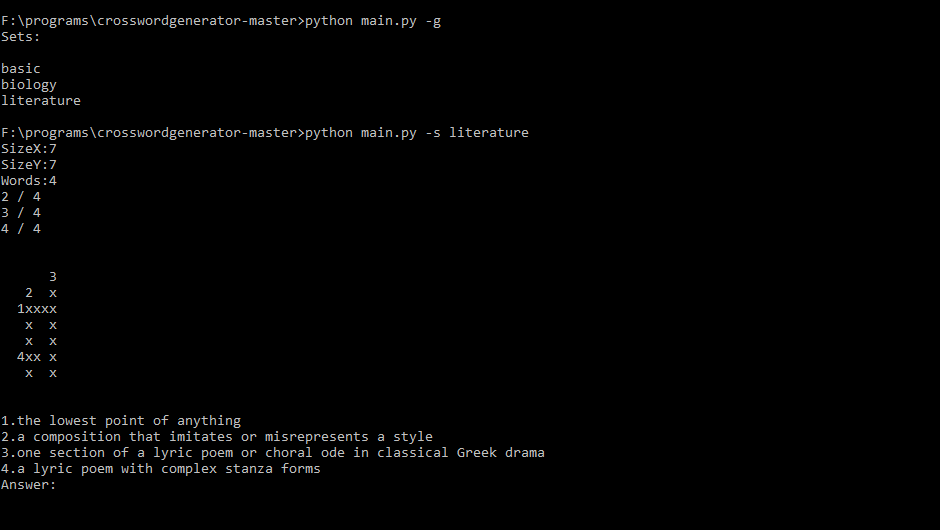
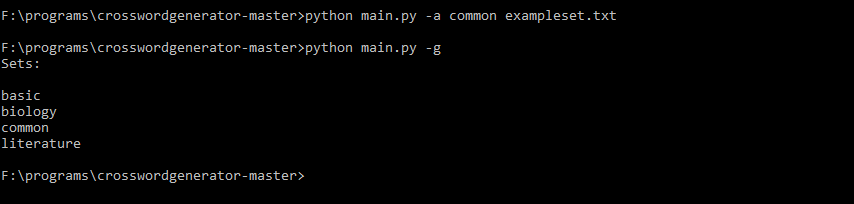

# CrosswordGenerator
Crossword Generator is a programm that allows to generate crosswords from custom word sets and solve them. 
At preinstalled word sets dictionarry meanings are used as a questions. This project is made for Vilnius school of AI.
# Usage
Install `pip install -r requirements.txt` 

CLI structure: `main.py [-h] [-a ] [-s] [-g]`

optional arguments: 
  `-h, --help`     show this help message and exit 
  `-a  , --add`    add new data set [set name] [words file] 
  `-s , --start`     run with selected data set [set name] 
  `-g, --getlist`  get list of data sets 
  
To get list of avalable word sets run `python main.py -g` 
`Sets:` 
`basic` 
`biology` 
`literature`

Than to strat generation process run `python main.py -s [set name]` with name of one word set. 
Set proportions: 
`SizeX:[int val]` 
`SizeY:[int val]` 
`Words:[int val]` 

If generator can't fit all words in the field it will break generation and show only fitted words.

All word are encrypted like `[question num]xxxxx`. For example word  `home` would look like `1xxx`.
To answer the question write `Answer:[question num].[answer]`. All answers are exactly one word. 
If answer is incorrect, word place at crossword will be shaded with red. Otherwise word would be inserted at its place.
To find words place write `[question num].`

Commands of `Answer:` field: 
`get_hint` allows to see all answers to questions 
`exit_cr` allows to break execution of a programm  
To add custom data set create txt file where each line is `[word]|[question]`. All words with spaces in the middle or not letters would be removed. 
Than run `python main.py -a [new set name] [words file]` 
Now you can find name of this set after running `python main.py -g`
# Examples
Generate crossword:

